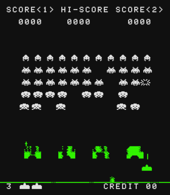

# Intel 8080 Space Invaders Emulator in Rust

Original version that ran on the Taito 8080 hardware.

## Running the emulator

Clone the repo and build the emulator with `cargo build --release`.

The game rom cannot be distributed here for copyright reasons. Sound samples are available in the [assets](assets)-folder. Sounds were created at [jsfxr](https://sfxr.me/) with the same copyright as the source code. Sounds could be customized with other samples if filenames and format are kept as-is (8-bit mono 11025Hz).

Sounds and the game rom should be located in a common folder called `assets` as a sub-directory in the current working directory. The game rom should be in one single file called `invaders.rom`, with the whole program in correct order. Then execute the binary `./target/release/inv8080rs` directly or do `cargo run --release` to start the emulator.

## Design notes

* [cpu.rs](src/cpu.rs) Intel 8080 CPU model. Only the instructions used by the game are implemented.

  Instructions are modeled as enums, carrying any immediate data. Execution is one big match-statement. Common cpu-operations have their own functions ("micro-code") to avoid duplication.

* [emu.rs](src/emu.rs) SDL2-based I/O (keyboard, graphics, sound).

  Runs the cpu-model in a loop at approximately the original speed (2 MHz) with the original 60 Hz display update. Two interrupts are generated during each frame (one in the middle of execution and one at the end). The execution is single-threaded.

  The framebuffer is a piece of RAM-memory that needs to be rotated 90 degrees ccw before display. This transformation is done on-the-fly in the cpu:s `display`-function. A slight retro pixelated effect is then applied via alpha-blending of a grid on top of the game scene. Lastly the colored overlay is created by filling bands across screen with blend mode `mul`.

  Sound is handled with queues for each individual sample. Each sample is played only once while the corresponding bit is set. The looping feature for the UFO-sound has not been implemented.

  Mapping keys to input-bus bits straightforwardly using scan-codes.

  * `5` add credits
  * `1` start 1-player mode
  * `2` start 2-player mode
  * `Left arrow` player 1 left
  * `Right arrow` player 1 right
  * `Left ctrl` player 1 fire
  * `D` player 1 left
  * `G` player 1 right
  * `A` player 1 fire
  * `T` tilt and game over!
  * `Esc` quit

* [utils.rs](src/utils.rs) A couple of useful functions.
* [main.rs](src/main.rs) Creates a CPU model, sets some options, connects it to the emulator, then runs the emulator.

## Useful resources

- [Emulator 101](https://web.archive.org/web/20240118230840/http://www.emulator101.com/), most people reference this excellent walk-through. It seems like the original site is down so I'm linking to the Internet Archive instead for now.
- [Computer Archeology - Space Invaders](https://computerarcheology.com/Arcade/SpaceInvaders/), could be enough for a more experienced emulator writer to implement everything.
- [Emulation of the Space Invaders Arcade Hardware](https://hotto.de/software-hardware/emulation-of-the-arcade-game-space-invaders/)
- [Space Invaders Emulator](https://www.justin-credible.net/2020/03/31/space-invaders-emulator/)
- [System 16 - The Arcade Museum](https://www.system16.com/hardware.php?id=629), some non-technical info about the Taito 8080 hardware used for Space Invaders among others. Links to some cool old advertising flyers.
- [Intel 8080 OPCODES](https://pastraiser.com/cpu/i8080/i8080_opcodes.html), compact table of the Intel 8080 instructions and flags.
- [Emutalk - Space Invaders thread](https://www.emutalk.net/threads/space-invaders.38177/page-2), helpful insights by people having the same bugs as me.
- **Intel 8080 Microcomputer Systems User's Manual**, from september 1975. Chapter 4 - Instruction Set is invaluable.
- **Intel 8080 Assembly Language Programming Manual**, also from 1975. It is also very useful to understand in more detail how to implement the opcodes correctly as well as understanding 8080 assembler code.
- [Understanding the x86's Decimal Adjust after Addition (DAA) instruction](http://www.righto.com/2023/01/understanding-x86s-decimal-adjust-after.html), DAA is needed for scoring and credits.
